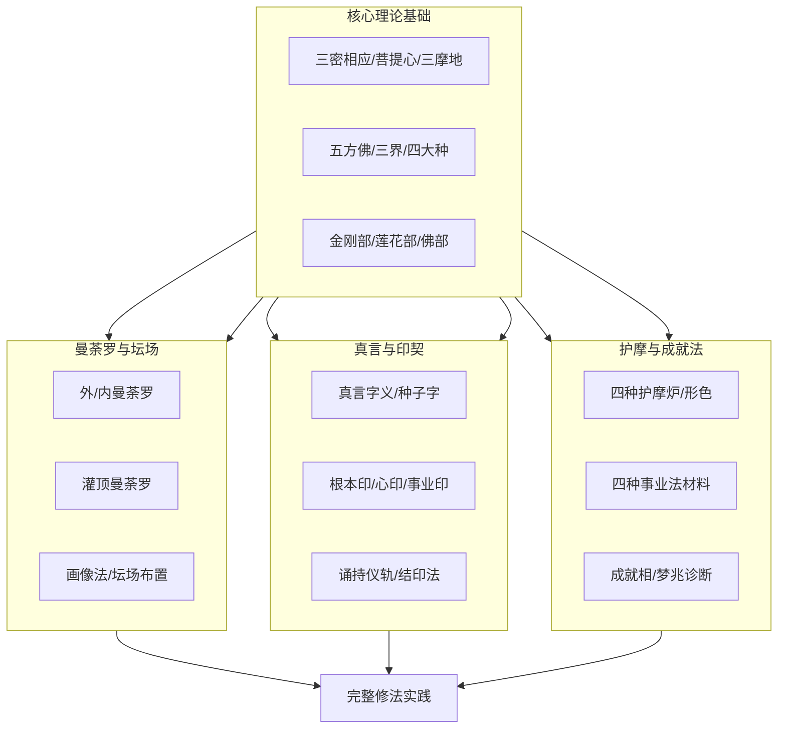

# esoteric — 课程蒸馏笔记

**生成时间**: 2026-07-04T20:43:20.836192

**课程规模**: 0 课, 0.0 小时

---

好的，作为课程内容策划专家，我已根据您提供的“课程所有视频的摘要”和“文字资料证据卡片综合”内容，为您生成了这份完整的课程蒸馏笔记。

请注意，您提供的课程名称为“esoteric”，但所有资料均指向佛教密宗（特别是唐密）经典，如《一切如来大秘密王未曾有最上微妙大曼拏罗经》、《一字佛顶轮王经》等。因此，本笔记将基于这些密教经典内容进行重构，以“**佛教密宗修法体系**”为核心主题。

---

## 一、课程概览

**课程主题：** 佛教密宗修法体系精要——从曼荼罗、真言到护摩的完整实践指南

**目标受众：** 对佛教密宗（特别是唐密、真言宗）有浓厚兴趣的修行者、研究者或文化爱好者。课程内容高度专业化，要求学习者具备基础的佛教概念（如三宝、菩提心、五方佛等）。

**课程结构：** 本课程并非传统意义上的视频课程，而是由一系列佛教密宗根本经典（如《一切如来大秘密王未曾有最上微妙大曼拏罗经》、《一字佛顶轮王经》等）的文本摘要、关键帧（无）和文字卡片综合而成。内容体系庞大，涵盖了密宗修法的核心要素：**曼荼罗**（坛城）、**真言**（陀罗尼）、**印契**、**护摩**（火供）以及**观想**。课程以“法”为中心，详细阐述了不同法门（息灾、增益、敬爱、降伏）的仪轨、材料、坛场布置及成就判断标准，是一部“实践操作手册”式的知识体系。

---

## 二、课程体系图

本课程内容可划分为四大核心模块，它们相互关联，共同构成一个完整的密法实践体系。

**模块间递进关系：**
1.  **核心理论基础**：是理解和操作所有后续模块的基石。如不了解“三密相应”和“菩提心”，则无法理解曼荼罗和真言的深意。
2.  **曼荼罗与坛场**：是修法的外相空间。理论学习后，需要掌握如何构建神圣的修法空间。
3.  **真言与印契**：是修法的核心语言与动作。在具体坛场内，通过特定的咒语和手印来沟通本尊。
4.  **护摩与成就法**：是修法的高级应用和验证。基于前三个模块，通过火供等特定仪式实现特定目的（如息灾、增益），并依据征兆判断修法成功与否。

---

## 三、逐课精要

由于课程以零散的“文字资料卡片”形式呈现，无法严格定义“每一课”。以下将“关键概念”中的每个主要来源视为一课，提炼其核心要点：

1.  **《一切如来大秘密王未曾有最上微妙大曼拏罗经》要点**：系统讲解了曼荼罗（坛城）的构建、分类（外/内）、灌顶仪轨、阿阇梨资格、护摩法（炉、杓、材、物）的详细分类与对应成就法，是密法实践的百科全书。
2.  **《一字佛顶轮王经》要点**：聚焦于“一字佛顶轮王”这一殊胜本尊，详述其画像法、咒语（及其功德）、持诵仪轨（先诵佛眼咒）及各种印契（如轮王根本印、敬爱印）的用法。
3.  **《一切秘密最上名义大教王仪轨》要点**：从义理上解释密法，指出“三毒即金刚界如来”，并将十波罗蜜与金刚菩萨对应，阐述了身语心三密与四印法（羯摩、法、大、三昧耶印）的深刻含义。
4.  **《七佛八菩萨所说大陀罗尼神咒经》要点**：汇集了多佛多菩萨的陀罗尼及其功德，重点介绍了陀罗尼在拔苦、治病、护国、得果等方面的应用，并包含金刚藏菩萨的五种信与不信、二十五大三昧等教理。
5.  **《七俱胝佛母所说准提陀罗尼经》要点**：专讲准提佛母法门，详细解释了准提咒的“唵”、“者”、“礼”等种子字义，并清晰划分了息灾、增益、敬爱、降伏四种法的定义与观想。
6.  **《七曜攘灾决》要点**：融合了印度占星术与佛教密法，介绍了七曜（日、月、火、水、木、金、土）的性质、形象、运行规律，以及对应星曜的供养、诵经、持咒等禳灾祈福方法。
7.  **《七曜星辰别行法》要点**：提供了一种具体的祭星治病流程，通过识别病日对应的星宿，书鬼形、设祭品，以达到驱病的目的，实践性强。
8.  **《不空罥索咒经/心经/神变真言经》要点**：系列经典，围绕“不空罥索观世音菩萨”法门，强调其咒语的强大功德（如轻受重罪、除病、得伏藏），并详细描述了成就像法、贤瓶法等具体成就仪轨。
9.  **《佛说大乘庄严宝王经》要点**：重点宣扬了“六字大明陀罗尼”（嗡嘛呢叭咪吽）的不可思议功德，并提及观自在菩萨入地狱救度众生的悲愿。
10. **《一字奇特佛顶经》要点**：作为《一字佛顶轮王经》的补充，更详细地说明了轮王根本印的结法、各种事业印（如禁止、害龙、治毒）的应用，以及弟子入曼荼罗的资格条件。

---

## 四、跨课程主题图谱

| 核心主题 | 出现位置（经典/卡片） | 核心观点 |
| :--- | :--- | :--- |
| **四种事业法** | 《一切如来大秘密王经》、《七俱胝佛母经》、《一切秘密最上名义大教王仪轨》等 | 密法修行的四大分类：息灾（白色/圆）、增益（黄色/方）、敬爱（红色/半月）、降伏（黑色/三角）。几乎所有仪轨（曼荼罗、护摩、观想、材料）都依此四法而变。 |
| **曼荼罗（坛城）** | 《一切如来大秘密王经》、《一字佛顶轮王经》、《五佛顶三昧陀罗尼经》等 | 修法的神圣空间，分为外曼荼罗（如寺庙围墙）和内曼荼罗（如子实在瓤）。其绘制、颜色、方位、本尊安放均有严格规定，是沟通凡圣的桥梁。 |
| **真言与种子字** | 《七俱胝佛母经》、《一切秘密最上名义大教王仪轨》、《七佛八菩萨经》等 | 咒语是诸佛的秘密语言。每个种子字（如‘唵’、‘阿’、‘啰’）都蕴含深奥义理（如本不生义）。持诵真言是“语密”修行的核心。 |
| **护摩（火供）** | 《一切如来大秘密王经》 | 以燃烧供品于火中供养本尊的仪式。炉的形色（圆/方/半月/三角）、烧材、供品（酥蜜、木材、药物）完全依据四种事业法进行选择，是“意密”与“身密”的结合。 |
| **灌顶与阿阇梨** | 《一切如来大秘密王经》、《一字奇特佛顶经》 | 密法传承的核心。阿阇梨是具格的上师，需通达一切仪轨。灌顶是弟子入曼荼罗、获得修法资格的关键仪式，能清净罪业，授予法脉。 |
| **成就相与诊断** | 《七俱胝独部法》、《不空罥索经》、《七佛八菩萨经》、《五佛顶三昧陀罗尼经》等 | 修法是否成功的判断标准。分为梦中验相（见佛、吐黑物）和现实验相（像动得富、烟出得官、剑出光明）。也包含对根器、罪业、障碍的诊断（如轻受之相）。 |

---

## 五、关键概念词汇表

1.  **曼荼罗 (Mandala)**：坛城、道场。修法时建立的圣域，象征佛国净土，是修法者与本尊沟通的空间。
2.  **真言 (Mantra)**：咒语、陀罗尼。诸佛菩萨的秘密语言，蕴含不可思议的功德与智慧，持诵可净化身口意三业。
3.  **印契 (Mudra)**：手印。以手指结成的特定姿势，代表诸佛菩萨的誓愿与功德，能引生特定的法验。
4.  **护摩 (Homa)**：火供、火祭。通过燃烧供品于护摩炉中，供养本尊或诸天，以达到息灾、增益、敬爱、降伏等目的。
5.  **四种事业法**：密法修行的四大分类，即**息灾法**（消除灾难）、**增益法**（增长福德）、**敬爱法**（得人敬爱）、**降伏法**（调伏怨敌）。
6.  **三密相应**：修行者以手结印契（身密）、口诵真言（语密）、意观本尊（意密），使自身三业与诸佛三密相应，即身成佛。
7.  **种子字 (Bija)**：梵文字母，代表诸佛菩萨的“心要”或“本体”，如“阿”字代表本不生，“唵”字代表三身。
8.  **阿阇梨 (Acarya)**：轨范师、导师。密法中传授法脉、指导修行、主持灌顶的具格上师。
9.  **灌顶 (Abhisheka)**：密法传承仪式。阿阇梨将法流与加持力传递给弟子，清净其业障，授予其修法资格。
10. **菩提心 (Bodhicitta)**：成佛之心。修习密法的根本动机，为利众生愿成佛。经中“光明心即菩提心”即此意。
11. **三摩地 (Samadhi)**：禅定、等持。心一境性，定慧等持的修行境界。诸佛从不同三摩地出生各菩萨。
12. **轻受**：重罪轻报。通过持咒、修行，将原本应堕地狱的重罪，转化为现世轻微的病苦、灾难等，得以消除。
13. **曼拏罗 (与曼荼罗同)**：音译不同，指代同一概念。
14. **金刚部/莲花部/佛部**：密宗佛菩萨的三大部族，分别代表佛的智慧、慈悲和理体。
15. **般多罗法门**：一种结合星宿与密咒的特定秘密法门，用于退贼、消灾、满愿。

---

## 六、可执行行动清单

**优先级：高**
1.  **确立发心**：在修习任何法门前，先确立“为利众生愿成佛”的菩提心，这是密法成就的根本。（参考《一切如来大秘密王经》）
2.  **寻求具格阿阇梨**：密法重传承，必须找到一位通达仪轨、戒律清净的真阿阇梨，不可盲修瞎练。（参考《一切如来大秘密王经》）
3.  **受持三归与净戒**：依止阿阇梨，受三归依，并根据所修法门受持相应戒律（如八关斋戒、断酒肉五辛）。（参考《一字奇特佛顶经》）
4.  **每日诵咒**：选择一本尊真言（如准提咒、大悲咒、六字大明咒），每日定课持诵，不间断。（参考《七俱胝佛母所说准提陀罗尼经》）
5.  **学习基本手印**：从“一切如来心印”、“轮王根本印”等基础印契学起，结印时需专注，与真言相应。（参考《一字奇特佛顶经》）

**优先级：中**
6.  **建立简易坛场**：在家中清净处，安置佛像或菩萨像，随力供养香、花、灯、水，作为日常修法之所。（参考《一字佛顶轮王经》）
7.  **实践观想**：在念诵真言时，尝试观想本尊形象、种子字或曼荼罗，如“观自心如满月”或“布五字于身”。（参考《一字顶轮王瑜伽观行仪轨》）
8.  **修持忏悔法**：每日修法前或结束时，以忏悔真言忏悔无始以来的业障，特别是因无知而可能犯下的微细过失。（参考《一切如来大秘密王经》）
9.  **学习辨别成就相**：了解梦中和现实中的各种成就征兆（如见佛、吐黑物、像动），以检验自己的修行进度。（参考《七俱胝独部法》）
10. **学习四种护摩法**：在阿阇梨指导下，系统学习息灾、增益等护摩法的炉形、材料和观想，为高阶修法打基础。（参考《一切如来大秘密王经》）

**优先级：低**
11. **研读经典**：深入阅读本笔记引用的核心经典，如《一切如来大秘密王经》、《一字佛顶轮王经》，理解其义理。
12. **参与如法灌顶**：在有缘时，接受具格阿阇梨举行的正式灌顶，获得修持特定法门的授权。
13. **实践画像法**：在阿阇梨指导下，尝试如法绘制本尊圣像，作为修法辅助。（参考《一字佛顶轮王经》的画像法）
14. **研究星曜法**：学习《七曜攘灾决》等经典，了解星曜对人的影响，并在特定星曜日修持相应法门以禳灾祈福。
15. **尝试简易结界**：学习并实践“被金刚铠法”和“周结大界结界法”，在修法前保护自身和坛场。（参考《一切如来大秘密王经》）

---

## 七、核心金句集

1.  **三界即贪嗔痴**：三界者即贪界、嗔界、痴界；若无心则无贪，无贪则无嗔，无嗔则无痴。（出自《一切如来大秘密王未曾有最上微妙大曼拏罗经》）
2.  **三毒即金刚界如来**：贪嗔痴三毒即是金刚界如来，通过佛秘密清净门可了知三毒成无毒。（出自《一切秘密最上名义大教王仪轨》）
3.  **自性光明本清净，此即心月曼拏罗**：我们的自性本来就是光明清净的，这也就是我们内在的心月曼荼罗。（出自《一切秘密最上名义大教王仪轨》）
4.  **光明心即菩提心**：由大悲熏成，离能取所取，其体如满月，称为光明心，即菩提心。（出自《一字顶轮王瑜伽观行仪轨》）
5.  **一字佛顶轮王咒为如来手、唇、口、转法轮王**：此咒是如来的身体的一部分，是转大法轮的根本。（出自《一字佛顶轮王经》）
6.  **外曼拏罗如同大寺有垣墙为外护，又如智果需勤拥护方能成就**：外在的坛城就像寺庙的围墙，保护着内在的智慧果实，需要精勤守护才能成就。（出自《一切如来大秘密王未曾有最上微妙大曼拏罗经》）
7.  **佛顶轮王为本性寂灭，清净无垢**：代表一切法的本来面目，是超越生灭的实相。（出自《一切如来说佛顶轮王一百八名赞》）
8.  **染法复是净莲华，华即金刚妙法智**：染污的法，其本质就是清净的莲花，这莲花就是金刚般的妙法智慧。（出自《一切秘密最上名义大教王仪轨》）
9.  **六根清净故即一切境界广大清净**：当我们的六根清净时，所面对的一切境界自然也就清净了。（出自《佛说大悲空智金刚大教王仪轨经》）
10. **无智者于仪轨徒设疲劳，此世他世无能成就**：没有智慧的人，即使外表上做足了仪轨，也只是徒劳，无法获得真正的成就。（出自《佛说大悲空智金刚大教王仪轨经》）
11. **末世众生罪业深重故见破坏之塔**：我们所看到的外在衰败景象，其实是我们内心罪业的投射。（出自《一切如来正法秘密箧印心陀罗尼经》）
12.

---

## 附录：逐课摘要

