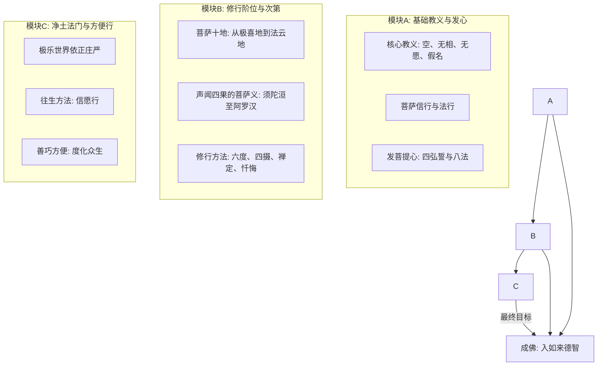

# lotus-avatamsaka — 课程蒸馏笔记

**生成时间**: 2026-07-04T08:28:18.463261

**课程规模**: 0 课, 0.0 小时

---

好的，作为课程内容策划专家，我将根据您提供的所有文本摘要和证据卡片，为您生成一份结构化的课程蒸馏笔记。请注意，由于您提供的摘要内容均来自多部佛教经典（特别是《华严经》相关经典），且视频数为0，我将以“文本课程”的形式进行组织，并从海量经文中提炼出核心的修行框架与哲学思想。

---

# lotus-avatamsaka — 课程蒸馏笔记

## 一、课程概览

**课程主题**：本课程名为“lotus-avatamsaka”，其内容核心源自《华严经》系统及相关大乘经典，旨在深入探讨“菩萨道”的完整修行路径与终极佛智境界。课程融合了多部经典（如《不退转法轮经》、《十地经》等），系统阐述了从凡夫发心、修行十地、直至成佛的完整理论体系与实践方法。

**目标受众**：本课程面向对大乘佛法，特别是菩萨道修学有深入兴趣的修行者、佛学研究者及追求精神升华的求道者。课程内容深奥，涉及大量佛教专业术语与哲学思辨，适合具备一定佛学基础的学员。

**课程结构**：基于所提供文本，课程内容可以归纳为三大核心模块：**1) 基础教义与发心**（如信、解、行、证）；**2) 修行阶位与次第**（如十地、四果的菩萨义）；**3) 净土法门与方便行**（如往生净土、善巧方便）。各模块内容相互交织，共同构成一个从理论到实践、从凡夫到成佛的完整体系。

## 二、课程体系图

**模块间递进关系**：
- **模块A**是理论基础，帮助学习者树立正确的世界观（空性）和人生观（菩萨行），并建立修行的根本目标（发菩提心）。
- **模块B**是修行的具体路径与阶位，详细描述了从初地到十地的菩萨行，并重新定义了声闻乘的果位，将其纳入菩萨道的体系之中。
- **模块C**是修行的实践应用与殊胜方便，特别是净土法门作为末法时代的易行道，以及菩萨以善巧方便广度众生的具体方法。三者最终共同导向“成佛”这一终极目标。

## 三、逐课精要

（注：由于无具体视频课，以文本为“一课”，汇总核心主题）

1.  **《不退转法轮经》**：阐述“不退转”的深义，重新定义声闻四果（须陀洹等）为菩萨行境，强调一切法空、假名、无相，信解此经即具足六度。
2.  **《佛华严入如来德智不思议境界经》**：描述如来以无功用、无分别的方式度化众生，具足无量功德；信解此法门能得三摩地与陀罗尼。
3.  **《佛说三十五佛名礼忏文》**：提供具体的忏悔法门，通过称念三十五佛名号，忏悔无始以来业障，以清净身心。
4.  **《佛说决定毗尼经》**：区分在家与出家菩萨的布施，指出菩萨因嗔痴犯戒为大犯，并阐述“究竟比尼”即一切法无垢、无染的法界实相。
5.  **《佛说十地经》**：系统阐述菩萨十地的名称、修法、功德与果相，是菩萨道修行的核心次第。
6.  **《佛说大乘入诸佛境界智光明庄严经》**：深入剖析“菩提”与“虚空等”，强调心性本自明亮，菩提无相、无入、无出、非三世，是如来境界的智慧光明。
7.  **《佛说大乘方等要慧经》**：提出菩萨速得一切智的“八法”，即内性清净、所行、所施、所愿、慈、悲、善权、智慧，是为快速成佛的纲要。
8.  **《佛说大乘无量寿庄严经》**：详细介绍阿弥陀佛的因地愿行与极乐世界的依正庄严，以及往生极乐世界的多种方法，强调“无相智慧”求生净土的重要性。
9.  **《佛说如幻三昧经》**：由文殊师利菩萨开示，以“如幻”三昧统摄一切法，提出“不除须发乃为善备沙门业”、“不发起戒是为学戒”等颠覆性见解，破除对修行形式的执着。
10. **《佛说如来兴显经》**：阐述如来兴显于世间的次第，以法雨一味随众生根器说法，并以十种法雨分别教化不同根性众生。
11. **《佛说摩诃衍宝严经》**：区分四种沙门（色像、诈威仪、名誉、真实），指出“四不持戒似如持戒”的相状，并教授“出世智药观心次第”，引导修行者内观心性。
12. **《佛说菩萨本业经》**：菩萨的“本业”即其愿行，经文详细描述了菩萨在日常行住坐卧中如何发愿，将一切行为转化为菩提资粮。
13. **《佛说济诸方等学经》**：警告末法时代菩萨贪求利养、毁谤法师的征状，强调菩萨应“等心愍众生、等解诸法无偏党”。
14. **《佛说观无量寿佛经》**：提供“十六观”的具体观想方法，作为往生极乐世界的修行法门，并详细区分了三辈九品往生的条件与相状。
15. **《佛说观普贤菩萨行法经》**：详细描述了忏悔业障的完整仪轨，包括见瑞相、六根忏悔、普贤菩萨现前等，强调忏悔清净后得陀罗尼。
16. **《得无垢女经》**：以问答形式，列出了菩萨成就种种功德（如坏魔王、动世界、放光明、得陀罗尼）的具体四法，是菩萨修行的行动指南。

## 四、跨课程主题图谱

1.  **空性与假名**：
    - **出现位置**：《不退转法轮经》、《佛说大乘入诸佛境界智光明庄严经》、《佛说如幻三昧经》。
    - **核心观点**：一切法（五阴、众生、佛、涅槃）皆是假名，无有自性，本性空寂。如来、菩提等亦是假名施设，不应执着。菩萨通过信解空、无相、无愿而得解脱。

2.  **菩萨道的阶位与定义**：
    - **出现位置**：《不退转法轮经》、《佛说十地经》、《十住经》。
    - **核心观点**：菩萨道的修行有清晰的次第（十地、十住）。经典重新定义了声闻四果，将其作为菩萨修行的阶段（如须陀洹是入圣道流，菩萨须陀洹是见一切法平等相）。菩萨修行需具足“八法”、“十愿”等具体标准。

3.  **净土法门的信愿行**：
    - **出现位置**：《佛说大乘无量寿庄严经》、《佛说大阿弥陀经》、《佛说无量清净平等觉经》、《佛说观无量寿佛经》。
    - **核心观点**：强调通过“信”（信有极乐世界、信阿弥陀佛）、“愿”（发愿往生）、“行”（念佛、修善、持戒）往生极乐世界。往生有不同层次（三辈九品），与修行者的信心、智慧、功德相关。强调“无相智慧”与“离相”是上品往生的关键。

4.  **善巧方便与度化众生**：
    - **出现位置**：《佛说大方广善巧方便经》、《佛说如幻三昧经》、《佛说决定毗尼经》。
    - **核心观点**：菩萨以善巧方便（方便智）度化众生，能于一法中具足六度，能礼一佛即礼诸佛，能与声闻同住而无异想。菩萨可现种种身（包括贪嗔痴相）以成熟众生，其行为不拘泥于表面形式，而在于内在的菩提心与空性慧。

5.  **心性本净与客尘烦恼**：
    - **出现位置**：《佛说大乘入诸佛境界智光明庄严经》、《佛说摩诃衍宝严经》。
    - **核心观点**：心法本来自性明亮、清净（心性本净），但被客尘烦恼（贪嗔痴）所染污。修行即是去除烦恼，显发自性光明。菩提非身得，亦非意识所知，需通过观心、离相、证空来契入。

## 五、关键概念词汇表

1.  **不退转（阿惟越致）**：指修行者（菩萨）发心后，不再退堕回二乘或凡夫地，决定成佛。《不退转法轮经》核心。
2.  **菩萨十地**：菩萨修行的十个重要阶位，从初地（极喜地）到十地（法云地），每一地都有其修行重点与成就。《佛说十地经》核心内容。
3.  **空、无相、无愿（三解脱门）**：佛教核心教义。空（一切法无自性），无相（离一切相），无愿（无所求），是通往解脱的三种法门。
4.  **假名**：指一切事物及概念（包括佛、菩提）只是为方便沟通而设立的名称，没有固定不变的实体。是理解“空”的关键。
5.  **善巧方便（沤和俱舍罗）**：菩萨度化众生时，根据众生不同根器而灵活运用的智慧和方法。是菩萨行的核心能力之一。
6.  **菩提心**：追求无上正等正觉（成佛）的宏大誓愿，是修习菩萨道的起点和根本动力。
7.  **六波罗蜜（六度）**：菩萨修行的六种主要方法：布施、持戒、忍辱、精进、禅定、智慧（般若）。
8.  **四弘誓愿**：菩萨的四种根本誓愿：众生无边誓愿度，烦恼无尽誓愿断，法门无量誓愿学，佛道无上誓愿成。
9.  **极乐世界（净土）**：阿弥陀佛因地愿行所成就的清净佛国，众生通过信愿行可往生该处，修行不退，直至成佛。
10. **无生法忍**：安住于诸法不生不灭的实相之理，心无动摇。是地上菩萨的重要成就。
11. **声闻四果**：传统佛教中修行达到的四个果位（须陀洹、斯陀含、阿那含、阿罗汉）。在本课程中被重新定义为菩萨修行中的特定行境。
12. **三昧（定）**：心专注于一境而不散乱的精神状态。众多菩萨三昧（如海印三昧、如幻三昧）是菩萨神通与度化众生的基础。
13. **陀罗尼（总持）**：一种能总持、忆念无量佛法而不忘失的智慧能力，通常与咒语、三昧相关联。
14. **如来藏/佛性**：一切众生本自具足的成佛潜能或清净自性。心性本净是此概念的基础。
15. **五逆十恶**：最严重的罪业，包括杀父、杀母、杀阿罗汉、出佛身血、破和合僧（五逆）以及十种恶行。但本课程以“假名”角度重新诠释，强调其本质空性。

## 六、可执行行动清单

**优先级：高**

1.  **每日发菩提心**：每日晨起，意念“众生无边誓愿度”等四弘誓愿，确立修行根本目标。
2.  **修习忏悔法门**：依《佛说三十五佛名礼忏文》或《观普贤菩萨行法经》方法，每日或定期忏悔业障，清净身心。
3.  **培养“无相”智慧**：在日常生活中，观察一切人事物（包括自身感受），思维其“假名”、“空性”的本质，不执着于相。这是往生净土的关键。
4.  **实践“善巧方便”**：在与他人相处时，尝试观察对方根性，以对方能接受的方式（不一定是直接说教）引导其向善，或以随喜、回向等方式积累功德。
5.  **选择一门深入**：根据自身根器，选择“净土法门”（持名念佛、观想）或“般若法门”（如《如幻三昧经》的观照），作为日常核心修法。

**优先级：中**

6.  **系统学习十地**：阅读并思维《佛说十地经》等，了解菩萨道的完整次第，明确自身所处阶段与努力方向。
7.  **践行“内性清净”**：按照《佛说大乘方等要慧经》的“八法”标准，特别是“内性清净”，时刻观照自心，去除谄曲、虚伪等染污。
8.  **培养四无量心**：修习慈、悲、喜、舍四无量心，尤其是“慈心”与“悲心”，这是菩萨行的基础。
9.  **供养三宝**：以财物、身语意（如赞叹、恭敬）供养佛法僧三宝，积累福德资粮。
10. **结伴共修**：寻找或组建清净的共修团体，互相策励，分享修行心得，避免孤陋寡闻。

**优先级：低**

11. **研究“假名”哲学**：深入学习《不退转法轮经》等，理解“如来”、“佛”、“众生”皆是假名，破除以“我”为中心的认知。
12. **练习“不坏世间相”**：学习菩萨在世间做种种事业（如工巧、经商），却不被其所束缚，保持心性的解脱。
13. **尝试“如幻”观照**：将生活中顺逆境界视为“如幻如梦”，练习减少情绪反应，保持内心的平静与觉知。
14. **精进于“四法”**：选择《得无垢女经》中感兴趣的一项成就（如“得陀罗尼”、“得三昧”），针对其所需的“四法”进行专项修学。
15. **为他人解说经典**：在自身有充分理解后，尝试为他人（如家人、朋友）解说经典中的一句一偈，践行法布施。

## 七、核心金句集

1.  **“不生不灭是如来增语。”** ——《佛说大乘入诸佛境界智光明庄严经》
    *   （点明如来境界的实相，超越生灭等二元对立。）

2.  **“不除须发乃为善备沙门之业。”** ——《佛说如幻三昧经》
    *   （强调真正的出家在于心，而非外在形式。破除对修行表相的执着。）

3.  **“菩提与虚空等，无高无下。”** ——《佛说大乘入诸佛境界智光明庄严经》
    *   （说明菩提自性平等，无有分别，与虚空同体。）

4.  **“心法本来自性明亮，但为客尘烦恼所坌污。”** ——《佛说大乘入诸佛境界智光明庄严经》
    *   （阐述“心性本净”的核心教义，烦恼是后天尘垢，非心之本然。）

5.  **“以无相智慧求生净土得莲花化生。”** ——《佛说大乘无量寿庄严经》
    *   （指明往生净土的最高心法，即不执着于相，以智慧导向净土。）

6.  **“女人如画瓮盛粪。”** ——《佛说大乘日子王所问经》
    *   （以强烈比喻揭示身体之不净，旨在破除对异性、对色身的贪欲执着。）

7.  **“补特伽罗非破坏空，即体是空，本非有故。”** ——《佛说大迦叶问大宝积正法经》
    *   （纠正“断灭空”的邪见，指出“人我”本空，非是破坏后才空，是“当体即空”。）

8.  **“若族姓子不发起戒，是为学戒。”** ——《佛说如幻三昧经》
    *   （阐释“无相戒”的深意，真正的持戒是心无所起，无所受，而非执着于戒相。）

9.  **“一切诸法皆如幻化，故无所入。”** ——《佛说如幻三昧经》
    *   （以“如幻”三昧总摄一切法，认识到万法虚幻，因此心无所住，亦无所入。）

10. **“礼一佛如来即同礼诸佛如来，因诸佛同一法性。”** ——《佛说大方广善巧方便经》
    *   （揭示了“一即一切”的华严境界，礼佛一佛即是礼敬法界诸佛，破除对佛的分别心。）

11. **“菩萨生疑惑者，为失大利。”** ——《佛说无量寿经》
    *   （警醒修行

---

## 附录：逐课摘要

