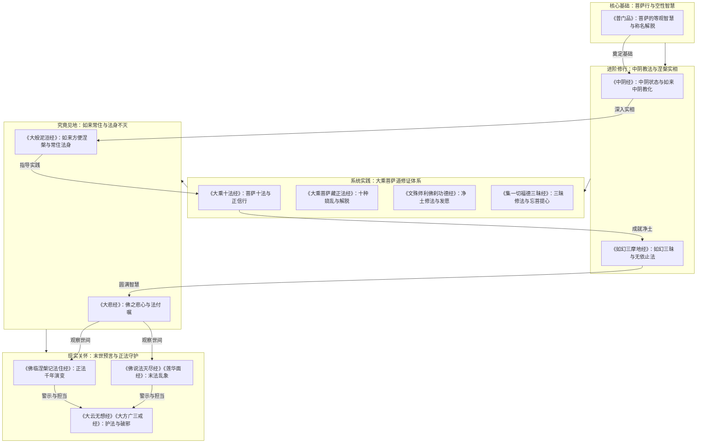

# ratnakuta-nirvana — 课程蒸馏笔记

**生成时间**: 2026-07-04T04:59:52.450605

**课程规模**: 0 课, 0.0 小时

---

好的，作为课程内容策划专家，我将根据您提供的所有课程摘要和资料证据卡片，为您生成一份结构完整、内容详实的课程蒸馏笔记。

---

## ratnakuta-nirvana 课程蒸馏笔记

### 一、课程概览

**课程主题**：本课程名为“ratnakuta-nirvana”（宝积涅槃），是一部深入探讨大乘佛教核心教义、修行法门与佛陀涅槃奥秘的综合性课程。课程内容横跨《普门品》《中阴经》《大乘十法经》《大般泥洹经》等多部重要经典，旨在帮助学习者建立对佛法根本原理（如空性、中道、菩萨行）的系统认知，并掌握从破迷开悟到终极解脱的完整路径。

**目标受众**：本课程适合对佛教哲学、修行实践有深度兴趣的学佛者、佛学研究者及寻求心灵解脱的修行人。学习者需具备一定的佛学基础，能够理解如“空性”、“中阴”、“三昧”等专业术语。

**课程结构**：基于提供的文本资料，课程内容可划分为五大核心模块：
1.  **菩萨行与解脱法门**：以《普门品》为核心，阐述菩萨的智慧与慈悲，以及“称名解脱”等具体修行方法。
2.  **中阴教法与涅槃奥秘**：以《中阴经》为主，揭示众生死亡后到投胎前的“中阴”状态，以及佛陀在涅槃过程中的教化。
3.  **大乘修行体系**：整合《大乘十法经》《大乘菩萨藏正法经》等，系统讲解大乘菩萨的成就法则、修行方法及应避免的过患。
4.  **如来常住与涅槃真义**：以《大般泥洹经》为中心，辨析“如来常住”的真实义，破除对佛陀“入灭”的世俗误解。
5.  **末世预言与法脉守护**：结合《佛临涅槃记法住经》《大悲经》等，揭示佛法在未来世中的演变与衰亡过程，并强调护持正法的重要性。

### 二、课程体系图

**模块递进关系**：
课程从最基础的大乘菩萨智慧（空性、平等）入手，逐步深入到死亡与中阴的神秘领域，建立对生命实相的认知。在此基础上，系统性地构建大乘修行体系，最终回归到对如来法身常住的最高见地进行辨析。最后，课程将佛法智慧应用于对现实世界的观察，探讨末法时代的乱象与护法责任，形成一个从理论到实践，从出世到入世的完整闭环。

### 三、逐课精要

（由于课程总数为0，无具体课时划分。此部分根据核心经典内容，为每一部核心经典撰写1-2句精要。）

1.  **《佛说普门品经》**：阐述观世音菩萨的慈悲智慧，开示“等游一切法”的甚深空观，并传授“称名解脱”的简便法门，是菩萨行的根本典范。
2.  **《中阴经》**：揭示众生死后至投胎前“中阴”状态的生命形态，详述妙觉如来（释迦牟尼佛）在中阴世界中的教化活动，是理解死亡与转世的根本经典。
3.  **《佛说大乘十法经》**：系统列举菩萨摩诃萨成就大乘道所应具足的十种正法，涵盖正信、行持、智慧、愿力等，是构建大乘修行体系的纲领性文件。
4.  **《佛说大般泥洹经》**：佛陀临涅槃前为大众开示“如来常住、法身不灭”的究竟实义，破除凡夫对“佛陀入灭”的执着，是辨析如来法身与应化身关系的核心经典。
5.  **《佛说如幻三摩地无量印法门经》**：开示“如幻三摩地”的修法，强调“无依止法”和“了知一切法从缘生”的空性智慧，是成就神通、度化众生的关键法门。
6.  **《大圣文殊师利菩萨佛刹功德庄严经》**：文殊师利菩萨发愿成就清净佛刹，佛详述其国土功德庄严及菩萨成就“不退大愿”的多种法门，是净土修法的指导经典。
7.  **《大悲经》**：佛陀以无尽悲心，将正法付嘱阿难，并详细开示凡夫虚妄颠倒、末法乱象及护持正法的重要性，是激发菩提悲愿的警世之作。
8.  **《佛临涅槃记法住经》**：佛陀预言佛法在灭度后十个百年的演变过程，从“圣法坚固”到“戏论坚固”，揭示了正法衰微的内在规律与外在表现。

### 四、跨课程主题图谱

| 核心主题 | 出现位置 | 核心观点 |
| :--- | :--- | :--- |
| **空性与中道** | 《普门品经》《大乘十法经》《如幻三摩地经》《大方广三戒经》等 | 一切法（色、声、香、味、触、法）皆是因缘和合、如梦如幻、无有实体。菩萨应观一切法平等，不住有为、无为，不执两边。 |
| **菩萨行与发心** | 《普门品经》《大乘十法经》《文殊师利佛刹功德经》《集一切福德三昧经》等 | 菩萨道核心在于发菩提心（上求佛道、下化众生），并通过六度（布施、持戒、忍辱、精进、禅定、智慧）四摄等具体法门实践，同时需远离贪、嗔、痴、慢、嫉等烦恼。 |
| **如来常住与涅槃真义** | 《大般泥洹经》《大悲经》《中阴经》 | 佛陀的“涅槃”并非彻底的断灭或消失，而是远离了生灭变异的“有为法”，进入常、乐、我、净的“无为”法身境界。佛陀的“入灭”是度化众生的方便示现。 |
| **中阴与生命流转** | 《中阴经》《佛说胞胎经》 | 众生死亡后，在进入下一期生命前，会经历一个名为“中阴”的过渡阶段，其形态微细，唯有佛能见。此阶段的众生仍可接受佛法教化，获得解脱。 |
| **末法预言与护法** | 《佛临涅槃记法住经》《法灭尽经》《大悲经》《大方广三戒经》等 | 佛法将经历正法、像法、末法时期，末法时代比丘破戒、贪著利养、戏论坚固，导致正法衰微。真正的修行者应于此乱世中，互相敬爱，严持戒律，护持正法。 |
| **三昧与禅定** | 《中阴经》《如幻三摩地经》《集一切福德三昧经》《佛说方等般泥洹经》 | “三昧”是佛法修行的重要境界和工具。通过修习不同种类的三昧（如三昧王三昧、如幻三摩地），可以断除烦恼、引发神通、深入实相、广度众生。 |

### 五、关键概念词汇表

1.  **观世音菩萨**：以其“观听”众生称名音声而施予救度的慈悲菩萨，是菩萨行中慈悲与智慧结合的典范。
2.  **等游**：菩萨以平等智慧，游历、观照一切法（色、声、香、味、触、法等），知其空性而不执著，是《普门品》的核心修行方法。
3.  **中阴**：指众生死亡之后、投胎之前的一种过渡生命状态，形态微细，由业力牵引，是获得解脱或继续轮回的关键时期。
4.  **大乘十法**：菩萨成就大乘道的十种根本法则，包括信敬三宝、供养父母师长、修慈悲喜舍、听闻正法、正信、正念、正定、智慧等。
5.  **如来常住**：指佛的法身是永恒、不变、真实存在的，超越了生灭变化，是佛教对佛陀本质的终极认知。
6.  **如幻三摩地**：一种甚深禅定，菩萨于此定中，了知一切法如幻如化，从而能自在示现、度化众生，而不被世间万象所迷惑。
7.  **波罗提木叉**：即别解脱戒，是佛教戒律的根本，佛在涅槃前强调“以戒为师”，戒是正顺解脱之本。
8.  **八正道**：通往涅槃解脱的八种正确途径（正见、正思惟、正语、正业、正命、正精进、正念、正定），是修行者的基本行为准则。
9.  **六度无极**：即六波罗蜜（布施、持戒、忍辱、精进、禅定、智慧），是菩萨修行成佛的六大法门，能度脱生死苦海，到达涅槃彼岸。
10. **十二因缘**：解释众生生死轮回根本原因的一系列因果链条（无明、行、识、名色、六入、触、受、爱、取、有、生、老死），是佛教的核心教义之一。
11. **师子奋迅三昧**：一种高级禅定，修行者能迅速、勇猛地出入各种禅定境界，比喻如狮子般无畏、自在。
12. **末法时代**：佛法流传的最后一个时期，此时期正法衰微，邪说横行，众生根器陋劣，修行者难以证果。

### 六、可执行行动清单

**高优先级**

1.  **建立正信**：每日思维并确认对佛法僧三宝的“正信”，远离疑惑不决，此为一切修行的基石。（《大乘十法经》）
2.  **以戒为师**：严格遵守“波罗提木叉”，将“戒”作为日常行为的根本准绳，制五根，不放逸。（《佛垂般涅槃略说教诫经》）
3.  **修习“等观”**：在日常接触色、声、香、味、触、法时，练习“等游”智慧，观其如梦幻泡影，不贪不嗔。（《普门品经》）
4.  **常念观音**：在日常生活中，遇到烦恼、恐惧、危难时，立即一心称念“观世音菩萨”名号，作为即时解脱的方法。（《普门品经》）
5.  **修习禅定**：每天安排固定时间修习禅定（如安那般那念），从制心一处开始，逐步深入学习，为证得三昧打下基础。（《中阴经》《佛垂般涅槃略说教诫经》）
6.  **发起菩提心**：每日发愿：“为利众生愿成佛”，并以此愿心指导一切言行，是进入大乘道的标志。（《文殊师利佛刹功德经》）
7.  **远离恶缘**：有意识地远离二十种应远离之事，特别是与异性（比丘尼）的过度接触、世俗诤论及恶知识。（《大宝积经》）
8.  **忍辱修心**：面对他人的侮辱、打骂或不公时，将其视为修忍辱的良机，内心不生嗔恨，如饮甘露。（《佛垂般涅槃略说教诫经》）

**中优先级**

9.  **学习经典**：系统学习《大乘十法经》等，明确菩萨道的具体成就标准，并对照自身进行反省。（《大乘十法经》）
10. **修习布施**：从财施、法施到无畏施，逐步扩大自己的心量，回向菩提，不生我慢。（《大乘十法经》）
11. **观察无常**：每日思维“诸行无常”，但不应因此厌离，而是为了更深刻地理解空性，不恐怖、不执著。（《大乘十法经》）
12. **实践“无依止”**：在修行和生活中，学习不依止任何内外境界，培养内心的独立与自由。（《如幻三摩地经》）
13. **守护正念**：常念如来正法，于一切时、一切处保持觉知，不令心念随妄境流转。（《大乘十法经》）
14. **亲近善知识**：主动寻找并亲近有正见、有修行的善知识，并对其生起如佛之想。（《文殊师利佛刹功德经》）

**低优先级**

15. **学习胚胎发育**：通过《佛说胞胎经》了解生命在母体中的形成过程，加深对“人身难得”、“身是不净”的认识，辅助修行。（《佛说胞胎经》）
16. **研究“中阴”教法**：深入学习《中阴经》内容，为临终和中阴阶段做好准备，培养对死亡的正见。（《中阴经》）
17. **参与法会供养**：在有条件时，参与寺院法会，学习如法供养，并将功德回向净土与菩提。（《大般涅槃经后分》）
18. **流通经典**：珍惜法宝，在机缘成熟时，以清净心向他人介绍、流通正法经典。（《大云无想经》）

### 七、核心金句集

1.  **“菩萨等游于色，即晓了解色如水沫不可得，无有坚固。”** ——《普门品经》
2.  **“戒是正顺解脱之本，名为波罗提木叉。”** ——《佛垂般涅槃略说教诫经》
3.  **“制之一处，无事不办。”** ——《佛垂般涅槃略说教诫经》（关于制心）
4.  **“能行忍者，乃可名为有力大人。”** ——《佛垂般涅槃略说教诫经》
5.  **“知足之人，虽卧地上，犹为安乐；不知足者，虽处天堂，亦不称意。”** ——《佛垂般涅槃略说教诫经》
6.  **“如来是常住、无为、非变易之法。”** ——《大般泥洹经》
7.  **“一切诸法住无所住，不可逮得，无有言教，离于二事，本际平等。”** ——《普门品经》
8.  **“菩萨观一切诸法如幻、如梦、如水中月、如响、如影、如响声，本不生灭。”** ——《大乘十法经》
9.  **“法界如称，平若虚空，无适无莫，真正无异。”** ——《普门品经》
10. **“头目髓脑，国城妻子，象马七珍，皆当弃舍。”** ——《大乘十法经》（形容为法舍身的精神）
11. **“三界欲最重，染著不可离。”** ——《中阴经》（指出修行最大障碍）
12. **“若人贪著利养……则愚痴我慢，破戒虚妄，毁谤沙门，远离佛法。”** ——《佛说护国尊者所问大乘经》
13. **“发菩提心后不应行贪爱、嗔恚、愚痴。”** ——《大圣文殊师利菩萨佛刹功德庄严经》
14. **“一切皆舍、于戒不缺、忍辱柔和、发起精进、成就静虑、智慧圆满、随念诸佛。”** ——《大圣文殊师利菩萨佛刹功德庄严经》（菩萨成就七法不退大愿）
15. **“从著想到流转失坏……最终不能速得菩提。”** ——《大宝积经》（概括执着带来的过患）

---

## 附录：逐课摘要

