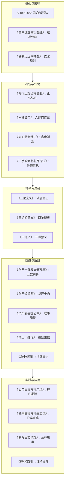

# schools — 课程蒸馏笔记

**生成时间**: 2026-07-03T22:51:59.447454

**课程规模**: 0 课, 0.0 小时

---

好的，作为一名课程内容策划专家，我将根据您提供的所有视频摘要、文字资料和关键帧信息，为您生成一份结构化的课程蒸馏笔记。

**课程名称**: 佛教经典与修行精要
**总视频数**: 0 课
**总时长**: 0.0 小时
**总转录字数**: 0 字

---

## 一、课程概览

**课程主题**：本课程是一部关于大乘佛教核心教义、修行方法与历史文献的综合性导论。它并非单一主题，而是深度融合了**戒律、禅观、净土、华严、中观**等几大重要宗派的思想精髓。课程旨在引导学习者从基础的身心净化和戒律持守入手，逐步深入到哲学思辨（如二谛、中道）和高级的圆融观行（如华严法界观），最终指向解脱与成佛的终极目标。

**目标受众**：本课程适合对佛教义理有初步了解，希望系统深入学习不同宗派思想的佛学爱好者、修行者及学术研究者。内容兼具实践指导（如忏悔、念佛、止观方法）和理论辨析（如三论宗、华严宗的哲学体系），对追求实修与理论并重的人群尤为有益。

**课程结构**：课程内容庞杂，但可梳理出清晰的脉络。它从最基础的“净心”与“持戒”出发，详细阐述了观心、忏悔、念佛等具体修行法门。随后，课程深入探讨了“二谛”与“中道”等核心哲学概念，并通过三论宗的论典进行辨析。在此基础上，课程进一步展开华严宗的“法界缘起”与“圆融无碍”的宇宙观，以及净土宗的“他力救度”与“念佛往生”的信仰体系。最后，课程通过禅宗语录、清规戒律等内容，展示了佛教思想在实践中的具体应用与勘验。

## 二、课程体系图

本课程可划分为以下五个核心模块，它们之间存在递进与互补关系：

## 三、逐课精要

由于课程没有明确的分课标题，我根据文件名和内容主题，将其归纳为以下“课程单元”，并为每一单元撰写核心要点：

1.  **《-1893.txt》 (净心诫观法)**：强调修道需先断财色，通过“诫”与“观”对治烦恼，并详细列举了六种难事、八风、十八界等概念，是指导行者从持戒入手，净化身心的基础课程。
2.  **《万善同归集 (3卷)〖唐 延寿述〗》**：倡导“理事双修”，驳斥执理废事的偏见，强调在即心是佛的认知下，仍需广修万行，并特别推崇高声念佛的十种功德。
3.  **《万松老人评唱天童觉和尚颂古从容庵录 (6卷)〗》**：通过评唱禅宗公案，阐释曹洞宗风，涉及“四句百非”、“宗通说通”等关键概念，是理解禅宗机锋与证悟境界的进阶课程。
4.  **《三圣圆融观门 (1卷)〖唐 澄观述〗》**：概述华严宗的核心观法，通过“能信所信”、“解行”、“理智”三对关系，阐明普贤（行/理）与文殊（解/智）二圣法门的圆融无碍。
5.  **《三论游意义 (1卷)〗&《三论玄义 (1卷)〗》**：系统阐述三论宗（中论、百论、十二门论）的宗旨、异同与作用，核心是“破邪显正”，辨析二谛、二智，是学习大乘空宗思想的必修课。
6.  **《二谛义 (3卷)〖隋 吉藏撰〗》**：详细辨析“二谛”（真谛、俗谛）的性质与作用，指出二谛是教化众生的“教”，而非真实的“理”，最终目标是引导众生悟入非有非无的“不二”之理。
7.  **《云门匡真禅师广录 (3卷)〗》**：展示了云门文偃禅师的接引风格，包括“一字关”、“代语”等独特教学法，强调学人必须亲证，反对在言句上卜度，是体验禅门凌厉宗风的实践课。
8.  **《五方便念佛门 (1卷)〖隋 智顗撰〗》**：将念佛与禅观结合，提出由浅入深的五种念佛三昧门（称名、观相、唯心、心境俱离、性起圆通），是一种系统化的念佛修行次第。
9.  **《净土十疑论》&《净土或问》&《净土论》**：净土宗的核心课程，通过问答形式破除对净土法门的疑惑，分析凡夫修行退转的原因，强调“信、愿、行”三资粮，并详细论述往生品位与修行方法。
10. **《六祖大师法宝坛经》**：禅宗根本经典，核心是“直指人心，见性成佛”，强调“无相、无念、无住”，批评住心观静为病，辨析功德与福德之别，是顿悟法门的最高指导。
11. **《华严一乘教义分齐章》&《华严经旨归》等**：华严宗的核心课程，系统建立“五教”（小、始、终、顿、圆）的判教体系，阐述“法界缘起”、“六相圆融”、“十玄门”等深奥哲学，展现事事无碍的华严世界观。
12. **《勅修百丈清规》&《禅林宝训》**：禅宗寺院的组织管理与道德规范课程，详细规定了寺院日常运作、法事仪轨、人事管理制度，并强调了住持的操守与德行对丛林的重要性。

## 四、跨课程主题图谱

以下是一些反复出现的核心主题及其在不同课程中的体现：

1.  **主题：心性论与净心**
    - **出现位置**：
        - **《-1893.txt》**: 核心主题，提出“净心”是目标，通过“诫”与“观”对治烦恼，令心转明净。
        - **《万善同归集》**: 主张“一切归心”，心净则感净土，心垢则感秽土。
        - **《六祖大师法宝坛经》**: 强调“自性本自清净”，但被无明覆盖，需识自本心，见自本性。
        - **《大乘止观法门》**: 提出“自性清净心”，并以此为基础展开止观修行。
    - **核心观点**：本课程体系认为，一切修行的根本在于认识和净化“心”。无论是通过持戒、禅观、念佛还是慧解，最终目标都是去除心的垢染，显发其本有的清净、智慧与功德。

2.  **主题：二谛与中道**
    - **出现位置**：
        - **《三论玄义》《三论游意义》**: 核心主题，以“破邪显正”的方式，系统辨析二谛（真谛、俗谛），指出二谛是“教”而非“理”，最终目标是悟入“中道”（非有非无）。
        - **《二谛义》**: 专论此主题，详细解释二谛的教义、作用及修行次第，强调依二谛说法以悟不二。
        - **《华严一乘教义分齐章》**: 在判教中，将“终教”和“顿教”与对二谛的不同理解联系起来。
    - **核心观点**：“二谛”是佛陀说法的根本原则，是引导众生从执着“有”或“空”的边见中解脱出来的善巧方便。真正的“中道”是超越一切言诠和对待的实相。

3.  **主题：念佛与往生**
    - **出现位置**：
        - **《五方便念佛门》**: 将念佛视为一种高级禅观，由浅入深，最终通向“性起圆通”。
        - **《净土十疑论》《净土或问》《净土论》**: 净土宗的核心，全面论述了念佛的动机、方法、条件和最终往生极乐世界的果报。
        - **《万善同归集》**: 将高声念佛作为万善之一，并强调其功德利益。
        - **《依观经等明般舟三昧行道往生赞》**: 描述般舟三昧的念佛修行与往生。
    - **核心观点**：在末法时代，靠自力修行困难，念佛求生净土是殊胜的“他力”法门。修行需具备“信、愿、行”，其中“行”包括专持名号、观想、礼拜、忏悔等，并需将一切善行回向西方。

4.  **主题：修行次第与方法**
    - **出现位置**：
        - **《-1893.txt》**: 提出“先断财色，后听经论”的入道次第。
        - **《修习止观坐禅法要》**: 详细阐述“具五缘、诃五欲、弃五盖、调五事、行五法”等止观前方便。
        - **《六妙法门》**: 提供“数、随、止、观、还、净”的六步修证次第。
        - **《劝发菩提心集》**: 详述发菩提心后的修行次第，如“十种大愿”、“六大决定誓”等。
        - **《华严发菩提心章》**: 提出“真空观、理事无碍观、周遍含容观”的三观次第。
    - **核心观点**：修行不是一蹴而就的，必须有清晰的次第。从持戒、忏悔等基础入手，再到禅定、慧观的深入，最后融会贯通，圆成佛道。不同宗派提供了不同的次第，但都强调循序渐进和持之以恒。

## 五、关键概念词汇表

1.  **净心**：通过教法与修行对治烦恼，使心垢渐灭、转趋明净，最终生起定慧与大乘信心，趣向菩提。
2.  **二谛**：指真谛（胜义谛，讲性空）与俗谛（世俗谛，讲缘起有）。是佛陀教化众生的两种真理层次，引导众生从“有”悟入“空”，最终超越“空有”。
3.  **中道**：远离“有”、“无”、“亦有亦无”、“非有非无”等一切边见，是佛教的终极真理。在三论宗中，中道即是“实相”。
4.  **破邪显正**：三论宗的根本方法。通过破除对一切法（包括佛所说教法）的执着（邪），来彰显正确的（正）空性之理。邪破则正自显。
5.  **法界缘起**：华严宗的核心理论，认为一切现象（法）都是由法界（真如本体）所缘起，互相依存，圆融无碍，一即一切，一切即一。
6.  **理事无碍**：华严宗重要观念。“理”指空性、真如；“事”指现象、万法。二者并非对立，而是相互融通、相互成就，理遍于事，事含于理。
7.  **念佛三昧**：通过系念一佛（如阿弥陀佛）而达到的禅定状态。是净土宗和禅宗都极为重视的修行法门，有多种层次，从口称名号到实相念佛。
8.  **五停心观**：对治五种烦恼的禅观方法：不净观（对治贪欲）、慈悲观（对治嗔恚）、因缘观（对治愚痴）、界分别观（对治我慢）、数息观（对治散乱）。
9.  **忏悔**：佛教重要的修行方法，通过发露罪过、生起惭愧、誓不更造，以清净三业，扫除修行障碍。有“作法忏”、“取相忏”、“无生忏”等不同层次。
10. **顿悟**：禅宗的核心主张，指不经过渐次修习，而直接、当下地觉悟到自心本性的佛性。与“渐修”相对。
11. **三十六对**：六祖惠能教授的说法方法，通过列举天与地、日与月、动与静等三十六对相对概念，在说法时出没即离两边，破除学人的执着。
12. **功德与福德**：六祖惠能所强调的区分。福德是通过布施、供养等外在行为获得的福报，可受用但不出轮回；功德是见性、平等、智慧的内在成就，是解脱的根本。
13. **别时意**：净土宗中的一种说法，指若仅有“愿”而无“行”，则往生是“别时”（未来某一世）才能实现的果报。强调“行愿兼修”才能即生成就。
14. **三辈往生**：《无量寿经》中所说，往生极乐世界的众生根据其修行深浅分为上、中、下三辈，每辈又有三品。是净土宗判释往生阶位的重要依据。
15. **四摄法**：菩萨度化众生的四种方法：布施、爱语、利行、同事。

## 六、可执行行动清单

**高优先级（核心修行）**

1.  **[日常] 每日修习“五停心观”**：选择最适合自己现行烦恼的对治方法（如数息观对治散乱），每日坚持10-15分钟。（来源：《-1893.txt》）
2.  **[日常] 修持“十念法”**：无论多忙，每日清晨或睡前，以真诚心、不间断地念“南无阿弥陀佛”十口气以上，作为定课。（来源：《净土或问》）
3.  **[周常] 进行一次“无相忏悔”**：每周抽时间，静坐反思，忏悔自己过去一周在身、口、意三业上的过失，并发愿未来不再造。（来源：《六祖大师法宝坛经》）
4.  **[日常] 实践“一行三昧”**：在日常行住坐卧中，保持“纯一直心”，无论做什么事，都专注当下，心无旁骛。（来源：《六祖大师法宝坛经》）
5.  **[周常] 阅读并思惟一段“二谛”教义**：每周学习《二谛义》或《三论玄义》中的一小段，思惟“有”与“空”的关系，并尝试用于观察生活中的烦恼。（来源：《二谛义》）

**中优先级（学习与思维）**

6.  **[计划] 系统学习“三论宗”**：制定一个3个月的阅读计划，依次精读《三论玄义》、《三论游意义》，掌握“破邪显正”的思辨方法。（来源：《三论玄义》）
7.  **[计划] 研习“华严宗”核心教义**：制定计划，学习“五教判释”、“理事无碍”、“十玄门”等概念，理解华严世界观。（来源：《华严一乘教义分齐章》）
8.  **[日常] 练习“代语”思维**：日常生活中，每当遇到一个难题或产生一个疑问时，尝试像云门禅师一样，给自己一个不落常规思维的“代语”答案，打破惯性思考。（来源：《云门匡真禅师广录》）
9.  **[周常] 抄写或读诵一部经文**：每周选择一部短经（如《心经》、《金刚经》），恭敬抄写或读诵，不求理解，但求心念专一。
10. **[日常] 实践“理事无碍”观**：在处理世俗事务时，提醒自己“事”的背后有“理”（空性），不执着于结果；同时，也不因为“理”而废弃“事”上的努力。（来源：《万善同归集》）

**低优先级（文化与制度）**

11. **[阅读] 阅读《禅林宝训》**：作为了解禅宗丛林精神和住持操守的入门书籍，学习古德的风范。（来源：《禅

---

## 附录：逐课摘要

